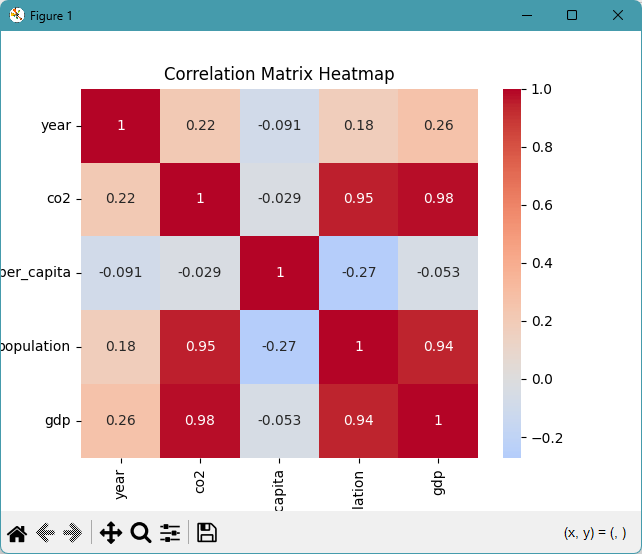

# datafun-06-applied

[](https://denisecase.github.io/pro-analytics-02/workflow-b-apply-example-project/)
[](./pyproject.toml)
[](./LICENSE)

> Professional Python project: applied data analytics.

## Project Goal

In this project, you perform a novel **Exploratory Data Analysis (EDA)**
using Jupyter notebooks or Python modules (your preference).
The addition of related data and/or SQL may be included and is optional.

Your goal: choose a new dataset, and explore it:
run checks, view distributions, identify missing values or outliers.
Create and present a custom project to explore a different tabular dataset.

For data suggestions, please see [data/raw/README.md](data/raw/README.md).

## Examples

The project includes an additional EDA on a real-world dataset.
Between this and the Module 4 example,
you should be able to see what parts are similar
(the general outline and workflow) and what changes with data.
The two projects together help create an appreciation
for the value of **reusable functions**.

## Working Files

You'll work with these areas:

- **data/raw** - raw data for exploration
- **docs/** - project narrative and documentation
- **src/** - supporting Python package modules
- **notebooks/** - interactive analysis
- **pyproject.toml** - update authorship & links
- **zensical.toml** - update authorship & links

## Instructions (pro-analytics-02)

Follow the
[step-by-step workflow guide](https://denisecase.github.io/pro-analytics-02/workflow-b-apply-example-project/)
to complete:

1. Phase 1. **Start & Run**
2. Phase 2. **Change Authorship**
3. Phase 3. **Read & Understand**
4. Phase 4. **Modify**
5. Phase 5. **Apply**

## Challenges

Challenges are expected.
Sometimes instructions may not quite match your operating system.
When issues occur, share screenshots, error messages, and details about what you tried.
Working through issues is part of implementing professional projects.

## Success

After completing Phase 1. **Start & Run**, you'll have your own GitHub project,
with the example notebook executed and committed,
and running the example script will print out:

```shell
========================
Executed successfully!
========================
```

A new file `project.log` will appear in the root project folder.

## Command Reference

<details>
<summary>Show command reference</summary>

### In a machine terminal (open in your `Repos` folder)

After you get a copy of this repo in your own GitHub account,
open a machine terminal in your `Repos` folder:

```shell
# Replace username with YOUR GitHub username.
git clone https://github.com/username/datafun-06-applied

cd datafun-06-applied
code .
```

### In a VS Code terminal

These are listed for convenience.
For best results, follow the detailed instructions in
[pro-analytics-02 guide](https://denisecase.github.io/pro-analytics-02/).

```shell
uv self update
uv python pin 3.14
uv lock --upgrade
uv sync --extra dev --extra docs --upgrade

uvx pre-commit install

git add -A
uvx pre-commit run --all-files
# repeat if changes were made
uvx pre-commit run --all-files

# run the example module and verify the environment (.venv/)
uv run python -m datafun.app_case

# do chores
uv run python -m pyright
uv run python -m pytest
uv run python -m zensical build

# save progress
git add -A
git commit -m "update"
git push -u origin main
```

</details>

## Notes

- Use the **UP ARROW** and **DOWN ARROW** in the terminal to scroll through past commands.
- Use `CTRL+f` to find (and replace) text within a file.
- You do not need to add to or modify `tests/`. They are provided for example only.
- Many files are silent helpers. Explore as you like, but nothing is required.
- You do NOT not to understand everything; understanding builds naturally over time.

## Troubleshooting >>>

If you see something like this in your terminal: `>>>` or `...`
You accidentally started Python interactive mode.
It happens.
Press `Ctrl+c` (both keys together) or `Ctrl+Z` then `Enter` on Windows.

## Example Output (Can Remove this Section after You Verify)

```shell
 | INFO | P06 | --- Section 9: Summary and next steps ---
 | INFO | P06 | ========================
 | INFO | P06 | SUMMARY
 | INFO | P06 | ========================
 | INFO | P06 | Dataset: owid-co2-data-subset
 | INFO | P06 | Original rows: 350
 | INFO | P06 | Clean rows:    308
 | INFO | P06 | Groups found in country: ['Brazil', 'Canada', 'China', 'France', 'Germany', 'India', 'Japan', 'United Kingdom', 'United States', 'World']
 | INFO | P06 | ======================
 | INFO | P06 | Review the results.
 | INFO | P06 | Determine the strongest correlations.
 | INFO | P06 | ======================
 | INFO | P06 | Look for interesting patterns in the charts.
 | INFO | P06 | Repeat the process, exploring additional angles.
 | INFO | P06 | After finding interesting insights, conclude your analysis.
 | INFO | P06 | ======================
 | INFO | P06 | Include instructions and specifics in your README.md file.
 | INFO | P06 | Write up your narrative on your docs/index.md file.
 | INFO | P06 | Include your next step suggestions for further analysis or modeling.
 | INFO | P06 | ======================
 | INFO | P06 | ----- in a script, call plt.show() once at the end to display all charts -----
 | INFO | P06 | ----- in a script, close the chart windows (with the close button) to continue  -----
 | INFO | P06 | EDA workflow complete
 | INFO | P06 | IMPORTANT: This script creates chart windows.
 | INFO | P06 | Close any chart windows and terminate this process with CTRL+c as needed.
 | INFO | P06 | ========================
 | INFO | P06 | Executed successfully!
 | INFO | P06 | ========================
```

## Findings and Visuals

Take screenshots of your charts and provide them here with a discussion.
In Markdown, display a figure by using:
an exclamation mark immediately followed by square brackets containing a useful caption
immediately followed by parentheses containing the relative path to your figure.
Note: When you start typing the path with a dot (.) for "here, in this directory",
the IDE may help complete the path.

In your custom project, follow this example, but

- your figures and narrative should reflect your work,
- this `README.md` should include your commands, process, and visuals, and
- `docs/index.md` should include your narrative.

Remove unnecessary instructional comments in your custom files.

Update these figures to present interesting results from your custom project:




## Project Documentation

Additional instructions, terms, and project notes:

[docs/index.md](docs/index.md)

## Citation

[CITATION.cff](./CITATION.cff)

## License

[MIT](./LICENSE)
