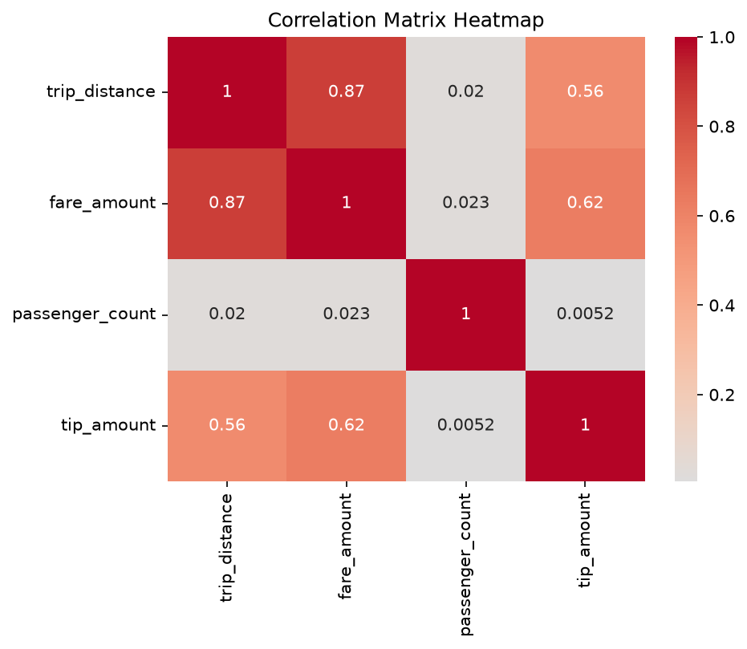
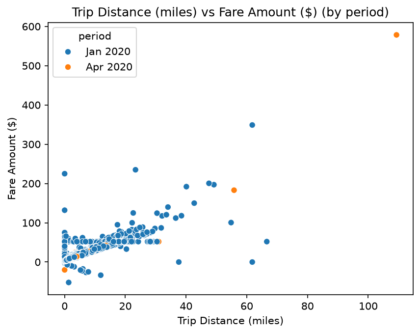
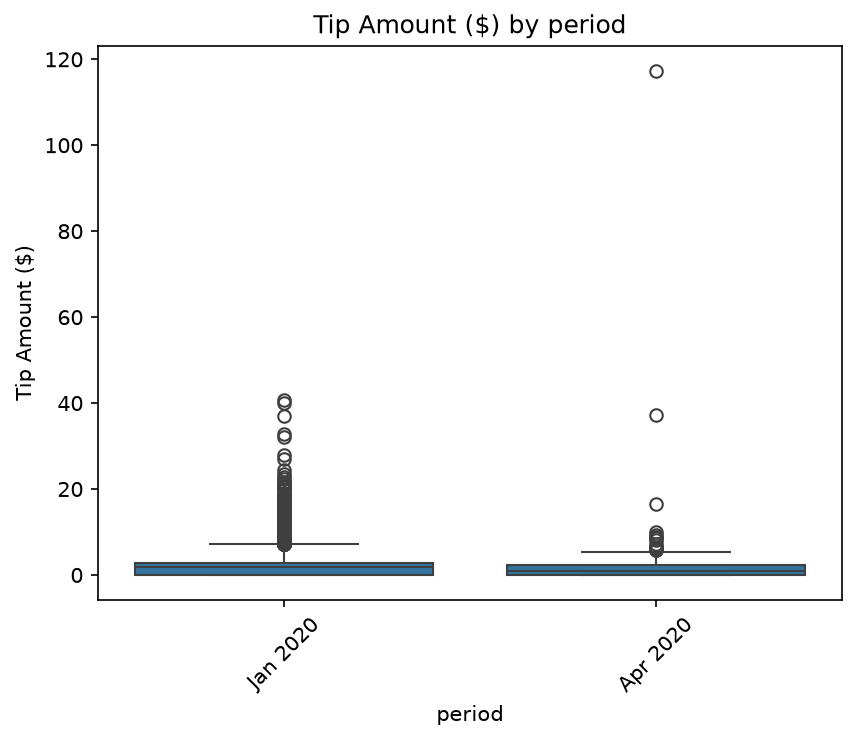

# datafun-06-applied

[](https://denisecase.github.io/pro-analytics-02/workflow-b-apply-example-project/)
[](./pyproject.toml)
[](./LICENSE)

> Professional Python project: applied data analytics.

## Project Goal

In this project, you perform a novel **Exploratory Data Analysis (EDA)**
using Jupyter notebooks or Python modules (your preference).
The addition of related data and/or SQL may be included and is optional.

Your goal: choose a new dataset, and explore it:
run checks, view distributions, identify missing values or outliers.
Create and present a custom project to explore a different tabular dataset.

For data suggestions, please see [data/raw/README.md](data/raw/README.md).

## Examples

The project includes an additional EDA on a real-world dataset.
Between this and the Module 4 example,
you should be able to see what parts are similar
(the general outline and workflow) and what changes with data.
The two projects together help create an appreciation
for the value of **reusable functions**.

## Working Files

You'll work with these areas:

- **data/raw** - raw data for exploration
- **docs/** - project narrative and documentation
- **src/** - supporting Python package modules
- **notebooks/** - interactive analysis
- **pyproject.toml** - update authorship & links
- **zensical.toml** - update authorship & links

## Instructions (pro-analytics-02)

Follow the
[step-by-step workflow guide](https://denisecase.github.io/pro-analytics-02/workflow-b-apply-example-project/)
to complete:

1. Phase 1. **Start & Run**
2. Phase 2. **Change Authorship**
3. Phase 3. **Read & Understand**
4. Phase 4. **Modify**
5. Phase 5. **Apply**

## Challenges

Challenges are expected.
Sometimes instructions may not quite match your operating system.
When issues occur, share screenshots, error messages, and details about what you tried.
Working through issues is part of implementing professional projects.

## Success

After completing Phase 1. **Start & Run**, you'll have your own GitHub project,
with the example notebook executed and committed,
and running the example script will print out:

```shell
========================
Executed successfully!
========================
```

A new file `project.log` will appear in the root project folder.

## Command Reference

<details>
<summary>Show command reference</summary>

### In a machine terminal (open in your `Repos` folder)

After you get a copy of this repo in your own GitHub account,
open a machine terminal in your `Repos` folder:

```shell
# Replace username with YOUR GitHub username.
git clone https://github.com/sum-randow/datafun-06-applied

cd datafun-06-applied
code .
```

### In a VS Code terminal

These are listed for convenience.
For best results, follow the detailed instructions in
[pro-analytics-02 guide](https://denisecase.github.io/pro-analytics-02/).

```shell
uv self update
uv python pin 3.14
uv lock --upgrade
uv sync --extra dev --extra docs --upgrade

uvx pre-commit install

git add -A
uvx pre-commit run --all-files
# repeat if changes were made
uvx pre-commit run --all-files

# run the example module and verify the environment (.venv/)
uv run python -m datafun.app_case


# do chores
uv run python -m pyright
uv run python -m pytest
uv run python -m zensical build

# save progress
git add -A
git commit -m "update"
git push -u origin main
```

</details>

## Notes

- Use the **UP ARROW** and **DOWN ARROW** in the terminal to scroll through past commands.
- Use `CTRL+f` to find (and replace) text within a file.
- You do not need to add to or modify `tests/`. They are provided for example only.
- Many files are silent helpers. Explore as you like, but nothing is required.
- You do NOT not to understand everything; understanding builds naturally over time.

## Troubleshooting >>>

If you see something like this in your terminal: `>>>` or `...`
You accidentally started Python interactive mode.
It happens.
Press `Ctrl+c` (both keys together) or `Ctrl+Z` then `Enter` on Windows.


```
```
## Commands

Commands used to set up and run this custom project:

```bash
uv sync --extra dev --extra docs --upgrade
uvx pre-commit run --all-files

uv run python -m datafun.app_case

git add -A
git commit -m "Phase 5 - 2020 NYC TaxiCab Use"
git push -u origin main
```

## Process

1. Identified the source dataset: NYC Yellow Taxi Trip Data, published by the
   NYC Taxi and Limousine Commission (TLC) via the NYC Open Data portal.
2. The full dataset contained 112,234,626 rows, far too large to work with directly.
3. Filtered the data at the source (using the portal's Data tab) to two single days
   for comparison: January 11, 2020 (pre-COVID) and April 11, 2020 (during COVID
   lockdown), both Saturdays. This reduced the dataset to approximately 200,000 rows.
4. Exported the filtered data as CSV and saved it to `data/raw/` as
   `yellow_taxi_2020_jan11_apr11_raw.csv`. This file is excluded from GitHub via
   `.gitignore` due to its size.
5. In the notebook, loaded the raw CSV (225,015 rows) and created a `period` column
   by parsing `tpep_pickup_datetime` into "Jan 2020" or "Apr 2020".
6. Randomly sampled the data down to 15,000 rows (`random_state=42` for
   reproducibility) and saved the result as `yellow_taxi_2020_jan11_apr11_raw_sample.csv`,
   which is committed to the repository.
7. Cleaned the sampled data by dropping rows with missing values in required columns
   (`trip_distance`, `fare_amount`, `passenger_count`), reducing the dataset from
   15,000 to 14,658 rows.
8. Reviewed descriptive statistics, a correlation matrix, and visualizations
   (scatter plot and box plot) grouped by `period`.

## Findings and Visuals



The heatmap shows a strong positive correlation between `trip_distance` and
`fare_amount` (0.87), and a moderate positive correlation between `fare_amount`
and `tip_amount` (0.62). `passenger_count` showed little relationship to any
other variable.



This scatter plot shows the strong distance/fare relationship holding across
both periods. It also reveals a striking outlier: a ~110-mile, $578.50 trip
recorded on April 11, 2020, during the height of NYC's COVID lockdown.



Despite a much smaller sample size, April 2020 tips followed a similar overall
distribution to January, with one notable outlier of approximately $116.

The most significant finding: taxi ridership dropped by approximately 96.5%
between January 11 and April 11, 2020 (14,163 vs. 495 clean trips), reflecting
the dramatic impact of COVID-19 lockdown measures on NYC transportation.

## Project Documentation

Additional instructions, terms, and project notes:

[docs/index.md](docs/index.md)

## Citation

[CITATION.cff](./CITATION.cff)

## License

[MIT](./LICENSE)
```
